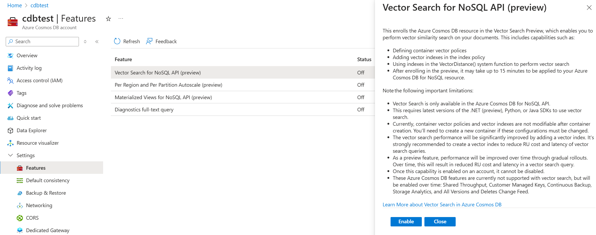

# Azure Cosmos DB Document to Vector ingestion pipeline Proof-of-concept

## Background
This purpose of this project is to demonstrate a proof of concept pipeline for ingesting content stored in document form (pdf, docx, etc) into a searchable index in Azure Cosmos DB.

### Pipeline stages
The basic stages of the pipeline include:

1. File upload to Azure blob storage.
1. Text extraction - converting the document format into raw text to be indexed.
1. Text chunking - breaking the text into reasonable size chunks for LLMs to process.
1. Text embedding - using an LLM to produce a vector embedding of the semantics of text chunk.
1. Text storage - storing each text chunk along with it's embedding in an Azure Cosmos DB container configured to perform efficient vector (and eventually Full-text) searches.


### Technology choices
Currently this proof of concept uses:
* Azure Blob storage for upload of documents.
* Azure Functions to process the pipeline.
* Azure Application Insights for logging.
* Azure KeyVault to store secrets.
* Azure Managed Identity to connect resources.
* Azure AI Document Intelligenct for text extraction using the `prebuilt-layout` model.
* Fixed size, non-overlapping text chunking.
* The `text-embedding-ada-002` embedding model from Azure OpenAI for embedding.
* Cosmos DB's `DiskANN` index for the resulting vectors.

## Setup

### Prerequisites
* An Azure subscription with access to Azure OpenAI.
* The Azure CLI installed.
* A Powershell prompt.
* Download the Azure Functions zip file* from [TODO: Post release here]() (or build your own from this repo with `dotnet publish -c Release`, and then zip the resulting publish directory)

### Steps
1. Create a Resource Group in your Azure subscritpion in the region where you want your resources deployed. Ensure it's a region that supports all of the above Azure Resource types. Examples include `West US`, `East US`, and `East US2`.

1. Set variables and subscription:
    ```powershell
    $sub = ""
    $rg = ""
    az account set --subscription $sub
    ```

1. Deploy initial set of resources
    ```powershell
    az deployment group create --name 'deploy1' --resource-group $rg --template-file 'main.bicep' -p .\main.bicepparam
    ```
    This step will likely take several minutes to complete - it will create all of the required Azure resources.

    NOTE: Some resource names must be globally unique. You can a different base name for the created resources by altering the `baseName` variable in the `main.bicepparam` file. If you do, make note of the new names for some of the steps below.

1. Enable Vector search in your Azure Cosmos DB account

    1. Navigate to the created Cosmos DB account in the Azure Portal.
    1. Click on the `Settings\Features` blade.
    1. Click on the `Vector Search for NoSQL API (preview)` feature, and then click `Enable`. Note: It can take up to 15 minutes to complete the enabling of this feature, and may cause errors during processing of documents during that time. We are currently investigating this issue.
    1. See the image below:

    

1. Deploy the functions app code
    Set variables for the path to the zip file you downloaded in the prerequisites, and for the name of the functions app. By default, that will be `docingfuncapp` as below. 
   ```powershell
        $zippedPath = "E:\deployment\functionapp.zip"
        $funappname = 'docingfuncapp'
        echo "---> Deploying Function Code"
        az functionapp deployment source config-zip -g $rg -n $funappname --src $zippedPath
    ```

1. Monitor traces
    ```powershell
    # Monitor traces and items in cosmosdb account.
    $funappname = 'functionapp'
    echo "---> Monitoring Function Code"
    func azure functionapp logstream $funappname
    ```
    Note - `func` above comes from the Azure Functions tools.  You can also view this log stream in the Azure Portal by navigating the the Azure Functions app created above, and clicking on the `Monitoring\Log Stream` blade.

1. Upload documents to Azure blob storage account
    1. Navigate to the storage account created above (`docingblobacc` by default).
    1. Click on the `Storage Browser` blade
    1. Click on `Blob containers` and then the `documents` folder.
    1. Click the `Upload` button in the toolbar, and then drag or browse to a document.
    1. Check the event stream, and your Cosmos DB account. The document should be processed and ingested into the `doc_search_container` container of the `semantic_search_db` database in this account.

1. Query data

    Build an intelligent, context-aware application using the searchable data in your Cosmos DB account. See the [documentation](https://learn.microsoft.com/en-us/azure/cosmos-db/nosql/vector-search) for details.

    Good luck!


## Contributing

This project welcomes contributions and suggestions.  Most contributions require you to agree to a
Contributor License Agreement (CLA) declaring that you have the right to, and actually do, grant us
the rights to use your contribution. For details, visit https://cla.opensource.microsoft.com.

When you submit a pull request, a CLA bot will automatically determine whether you need to provide
a CLA and decorate the PR appropriately (e.g., status check, comment). Simply follow the instructions
provided by the bot. You will only need to do this once across all repos using our CLA.

This project has adopted the [Microsoft Open Source Code of Conduct](https://opensource.microsoft.com/codeofconduct/).
For more information see the [Code of Conduct FAQ](https://opensource.microsoft.com/codeofconduct/faq/) or
contact [opencode@microsoft.com](mailto:opencode@microsoft.com) with any additional questions or comments.

## Trademarks

This project may contain trademarks or logos for projects, products, or services. Authorized use of Microsoft 
trademarks or logos is subject to and must follow 
[Microsoft's Trademark & Brand Guidelines](https://www.microsoft.com/en-us/legal/intellectualproperty/trademarks/usage/general).
Use of Microsoft trademarks or logos in modified versions of this project must not cause confusion or imply Microsoft sponsorship.
Any use of third-party trademarks or logos are subject to those third-party's policies.
